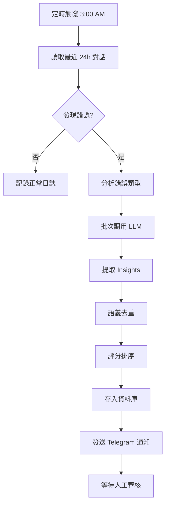
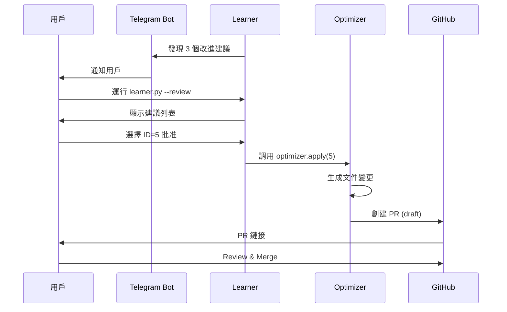

# 🏗️ 系統架構設計

## 總體架構

### 三層架構模型

```
┌─────────────────────────────────────────────────────────────┐
│                    應用層 (Application Layer)                │
├─────────────────────────────────────────────────────────────┤
│  Alkaid Agent (Kiro Framework)                              │
│  - 處理用戶對話                                              │
│  - 執行系統指令                                              │
│  - 記錄對話到 conversations.jsonl                            │
└────────────────────┬────────────────────────────────────────┘
                     │
                     │ 每日觸發
                     ↓
┌─────────────────────────────────────────────────────────────┐
│                   學習層 (Learning Layer)                    │
├─────────────────────────────────────────────────────────────┤
│  ┌──────────────┐  ┌──────────────┐  ┌──────────────┐      │
│  │   Analyzer   │  │   Learner    │  │  Optimizer   │      │
│  │  對話分析器   │  │   學習引擎    │  │   優化器      │      │
│  └──────┬───────┘  └──────┬───────┘  └──────┬───────┘      │
│         │                 │                 │               │
│         └────────┬────────┴────────┬────────┘               │
│                  │                 │                        │
│          ┌───────▼─────────────────▼───────┐                │
│          │      Scheduler (調度器)          │                │
│          │  - 定時任務管理                   │                │
│          │  - 工作流編排                     │                │
│          └───────┬─────────────────────────┘                │
└──────────────────┼──────────────────────────────────────────┘
                   │
                   ↓
┌─────────────────────────────────────────────────────────────┐
│                   存儲層 (Storage Layer)                     │
├─────────────────────────────────────────────────────────────┤
│  ┌─────────────────────┐  ┌──────────────────────┐          │
│  │ conversations.jsonl │  │   insights.db        │          │
│  │  (原始對話記錄)      │  │   (學習資料庫)        │          │
│  └─────────────────────┘  └──────────────────────┘          │
│                                                              │
│  ┌─────────────────────┐  ┌──────────────────────┐          │
│  │   changelog.md      │  │   config.yaml        │          │
│  │   (變更日誌)         │  │   (配置文件)          │          │
│  └─────────────────────┘  └──────────────────────┘          │
└─────────────────────────────────────────────────────────────┘
```

---

## 核心組件詳解

### 1. Analyzer (分析器)

**職責**：解析對話記錄，識別學習信號

#### 輸入
```python
{
    "source": "/root/.kiro/memory/conversations.jsonl",
    "time_range": "last_24h",
    "filters": ["errors", "corrections", "repetitions"]
}
```

#### 處理流程
```
1. 讀取 JSONL 文件
   ↓
2. 解析每條對話
   - timestamp
   - user_message
   - assistant_response
   - context (tools used, errors)
   ↓
3. 特徵提取
   ├─ 錯誤檢測
   │  ├─ SSH 超時
   │  ├─ Kubectl 失敗
   │  ├─ 工具執行異常
   │  └─ 語法錯誤
   │
   ├─ 用戶修正檢測
   │  ├─ "不對"、"錯了"
   │  ├─ 重複相同問題
   │  └─ 提供修正建議
   │
   └─ 模式識別
      ├─ 常見任務類型
      ├─ 工具使用頻率
      └─ 成功/失敗比率
   ↓
4. 輸出結構化數據
```

#### 輸出
```python
{
    "errors": [
        {
            "timestamp": "2026-03-14T03:15:22Z",
            "context": "SSH command execution",
            "error_type": "connection_timeout",
            "user_correction": "需要先檢查 SSH 連線狀態"
        }
    ],
    "patterns": [
        {
            "type": "frequent_task",
            "description": "檢查 OpenClaw Pod 狀態",
            "frequency": 12,
            "success_rate": 0.92
        }
    ]
}
```

---

### 2. Learner (學習引擎)

**職責**：調用 LLM 分析數據，生成改進建議

#### LLM Prompt 模板

```markdown
# 角色
你是一個 AI Agent 學習系統，專門分析 Alkaid Agent 的執行記錄並提取改進建議。

# 任務
分析以下對話記錄，識別可改進的模式：

## 錯誤記錄
{error_logs}

## 用戶修正
{user_corrections}

## 任務統計
{task_statistics}

# 輸出要求
生成 3-5 條具體的改進建議，格式：
1. **類型**: [規則/技能/Prompt]
2. **問題**: 具體描述當前問題
3. **建議**: 具體的改進措施
4. **預期效果**: 量化的改進目標

# 示例輸出
**類型**: 規則
**問題**: SSH 連線經常超時，未先檢查連線狀態
**建議**: 在 TOOLS.md 中添加規則：執行 SSH 指令前先運行 `ssh -o BatchMode=yes hetzner "uptime"` 檢查連線
**預期效果**: 減少 80% 的 SSH 超時錯誤
```

#### 處理流程

```python
class Learner:
    def analyze(self, analyzer_output: dict) -> List[Insight]:
        insights = []
        
        # 1. 批次處理錯誤
        for error_batch in batch(analyzer_output['errors'], size=10):
            prompt = self.build_prompt(error_batch)
            llm_response = self.call_llm(prompt)
            parsed_insights = self.parse_llm_response(llm_response)
            insights.extend(parsed_insights)
        
        # 2. 語義去重
        unique_insights = self.deduplicate(insights)
        
        # 3. 評分排序
        ranked_insights = self.rank_by_impact(unique_insights)
        
        # 4. 存入資料庫
        self.save_to_db(ranked_insights)
        
        return ranked_insights
```

#### 語義去重算法

```python
def deduplicate(self, insights: List[Insight]) -> List[Insight]:
    """
    使用 embedding 計算相似度，合併重複建議
    """
    embeddings = []
    for insight in insights:
        emb = self.get_embedding(insight.description)
        embeddings.append(emb)
    
    # 計算相似度矩陣
    similarity_matrix = cosine_similarity(embeddings)
    
    # 聚類合併（閾值 0.85）
    clusters = cluster_by_threshold(similarity_matrix, threshold=0.85)
    
    # 每個聚類選擇最高分項
    unique = []
    for cluster in clusters:
        best = max(cluster, key=lambda x: x.impact_score)
        unique.append(best)
    
    return unique
```

---

### 3. Optimizer (優化器)

**職責**：將改進建議轉化為實際文件變更

#### 變更類型

| 類型 | 目標文件 | 操作 |
|------|---------|------|
| **規則** | `~/.kiro/steering/TOOLS.md` | 添加新的工具使用規則 |
| **技能** | `~/.kiro/skills/new-skill/` | 創建新的 skill 目錄和 SKILL.md |
| **Prompt** | `~/.kiro/steering/IDENTITY.md` | 優化系統 prompt |
| **腳本** | `~/.kiro/scripts/new-script/` | 生成自動化腳本 |

#### 處理流程

```python
class Optimizer:
    def apply_insight(self, insight: Insight) -> ChangeResult:
        """
        應用一個改進建議
        """
        if insight.type == "rule":
            return self.add_rule_to_tools(insight)
        
        elif insight.type == "skill":
            return self.create_new_skill(insight)
        
        elif insight.type == "prompt":
            return self.optimize_identity(insight)
        
        elif insight.type == "script":
            return self.generate_script(insight)
    
    def add_rule_to_tools(self, insight: Insight) -> ChangeResult:
        """
        在 TOOLS.md 中添加新規則
        """
        # 1. 讀取現有文件
        content = read_file("~/.kiro/steering/TOOLS.md")
        
        # 2. 找到合適的插入位置
        section = self.find_relevant_section(content, insight.category)
        
        # 3. 生成規則文本
        rule_text = f"""
### {insight.title}

**問題**: {insight.problem}

**解決方案**:
{insight.solution}

**示例**:
```bash
{insight.example}
```

**預期效果**: {insight.expected_impact}
"""
        
        # 4. 插入並保存草稿
        new_content = insert_after_section(content, section, rule_text)
        save_draft("~/.kiro/learning/drafts/TOOLS.md", new_content)
        
        # 5. 記錄變更
        return ChangeResult(
            type="rule_added",
            file="TOOLS.md",
            diff=generate_diff(content, new_content),
            status="pending_approval"
        )
```

---

### 4. Scheduler (調度器)

**職責**：管理定時任務和工作流編排

#### 執行模式

```python
class Scheduler:
    def run(self, mode: str):
        if mode == "daily":
            self.daily_analysis()
        
        elif mode == "weekly":
            self.weekly_optimization()
        
        elif mode == "realtime":
            self.watch_for_errors()
    
    def daily_analysis(self):
        """
        每日分析流程
        """
        logger.info("🔍 開始每日分析...")
        
        # 1. 分析最近 24 小時對話
        analyzer = Analyzer()
        results = analyzer.analyze_recent(hours=24)
        
        if not results['errors'] and not results['patterns']:
            logger.info("✅ 未發現需要學習的內容")
            return
        
        # 2. 調用學習引擎
        learner = Learner()
        insights = learner.analyze(results)
        
        # 3. 發送通知
        if insights:
            notifier = Notifier()
            notifier.send_telegram(
                f"🧠 發現 {len(insights)} 個改進建議\n"
                f"運行 `python3 learner.py --review` 查看詳情"
            )
        
        logger.info(f"✅ 每日分析完成，生成 {len(insights)} 個建議")
    
    def weekly_optimization(self):
        """
        每週優化流程
        """
        logger.info("📊 開始每週優化...")
        
        # 1. 統計本週數據
        analyzer = Analyzer()
        weekly_stats = analyzer.get_weekly_stats()
        
        # 2. 分析成功模式
        successful_patterns = analyzer.extract_success_patterns(
            success_threshold=0.85
        )
        
        # 3. 生成 Prompt 優化建議
        optimizer = Optimizer()
        prompt_draft = optimizer.optimize_identity(successful_patterns)
        
        # 4. 創建 GitHub PR
        if prompt_draft:
            self.create_github_pr(prompt_draft)
        
        logger.info("✅ 每週優化完成")
```

---

## 資料庫設計

### SQLite Schema

```sql
-- insights.db

-- 錯誤記錄表
CREATE TABLE errors (
    id INTEGER PRIMARY KEY AUTOINCREMENT,
    timestamp TEXT NOT NULL,
    conversation_id TEXT,
    error_type TEXT NOT NULL,
    context TEXT,
    error_message TEXT,
    user_correction TEXT,
    status TEXT DEFAULT 'unprocessed',
    created_at DATETIME DEFAULT CURRENT_TIMESTAMP
);

CREATE INDEX idx_errors_timestamp ON errors(timestamp);
CREATE INDEX idx_errors_status ON errors(status);

-- 模式記錄表
CREATE TABLE patterns (
    id INTEGER PRIMARY KEY AUTOINCREMENT,
    pattern_type TEXT NOT NULL,
    description TEXT,
    frequency INTEGER DEFAULT 1,
    success_rate REAL,
    first_seen DATETIME,
    last_seen DATETIME,
    example_conversations TEXT,
    learned_response TEXT
);

CREATE INDEX idx_patterns_type ON patterns(pattern_type);

-- 改進建議表
CREATE TABLE improvements (
    id INTEGER PRIMARY KEY AUTOINCREMENT,
    type TEXT NOT NULL,
    title TEXT NOT NULL,
    problem TEXT,
    solution TEXT,
    expected_impact TEXT,
    impact_score REAL,
    source_error_ids TEXT,
    status TEXT DEFAULT 'pending',
    created_at DATETIME DEFAULT CURRENT_TIMESTAMP,
    approved_at DATETIME,
    applied_at DATETIME
);

CREATE INDEX idx_improvements_status ON improvements(status);
CREATE INDEX idx_improvements_score ON improvements(impact_score DESC);

-- 變更記錄表
CREATE TABLE changes (
    id INTEGER PRIMARY KEY AUTOINCREMENT,
    improvement_id INTEGER,
    change_type TEXT NOT NULL,
    target_file TEXT,
    diff TEXT,
    rollback_data TEXT,
    applied_at DATETIME DEFAULT CURRENT_TIMESTAMP,
    FOREIGN KEY (improvement_id) REFERENCES improvements(id)
);

-- 統計數據表
CREATE TABLE statistics (
    id INTEGER PRIMARY KEY AUTOINCREMENT,
    date TEXT NOT NULL,
    total_conversations INTEGER,
    error_count INTEGER,
    correction_count INTEGER,
    avg_response_time REAL,
    success_rate REAL,
    created_at DATETIME DEFAULT CURRENT_TIMESTAMP
);

CREATE UNIQUE INDEX idx_statistics_date ON statistics(date);
```

---

## 工作流圖示

### 每日分析工作流



### 改進建議審核流程



---

## 擴展性設計

### 插件系統

```python
class Plugin:
    """
    插件基類，允許擴展新的分析器、學習器、優化器
    """
    def __init__(self, config: dict):
        self.config = config
    
    def analyze(self, data: dict) -> dict:
        raise NotImplementedError
    
    def learn(self, analysis: dict) -> List[Insight]:
        raise NotImplementedError
    
    def optimize(self, insight: Insight) -> ChangeResult:
        raise NotImplementedError

# 示例：自定義錯誤檢測插件
class SSHTimeoutPlugin(Plugin):
    def analyze(self, data: dict) -> dict:
        ssh_errors = []
        for conv in data['conversations']:
            if 'ssh' in conv['context'] and 'timeout' in conv['error']:
                ssh_errors.append(conv)
        
        return {'ssh_timeouts': ssh_errors}
```

### 多 Agent 協作

```python
class MultiAgentOptimizer:
    """
    支持多個 Agent 共享學習成果
    """
    def sync_insights(self, agent_name: str):
        """
        從其他 Agent 同步 insights
        """
        # 從共享資料庫讀取
        shared_insights = self.db.query(
            "SELECT * FROM improvements WHERE agent='*' OR agent=?",
            [agent_name]
        )
        
        # 應用到本地
        for insight in shared_insights:
            if self.is_applicable(insight, agent_name):
                self.apply_insight(insight)
```

---

## 性能優化

### 批次處理

```python
# 避免逐條處理，使用批次
BATCH_SIZE = 10

def process_conversations(conversations):
    for batch in chunk(conversations, BATCH_SIZE):
        # 一次調用處理多條
        results = llm.batch_analyze(batch)
        yield results
```

### 緩存機制

```python
from functools import lru_cache

@lru_cache(maxsize=128)
def get_embedding(text: str) -> np.ndarray:
    """
    緩存 embedding 結果，避免重複計算
    """
    return openai.embeddings.create(
        input=text,
        model="text-embedding-3-small"
    )
```

### 增量分析

```python
class IncrementalAnalyzer:
    def analyze_since_last_run(self):
        """
        只分析上次運行後的新對話
        """
        last_timestamp = self.db.get_last_processed_timestamp()
        new_conversations = self.read_since(last_timestamp)
        return self.analyze(new_conversations)
```

---

## 監控與告警

### 健康檢查

```python
class HealthMonitor:
    def check_system_health(self) -> dict:
        return {
            'database_size': self.get_db_size(),
            'last_run': self.get_last_run_time(),
            'pending_insights': self.count_pending_insights(),
            'error_rate_24h': self.calculate_error_rate(),
            'llm_api_status': self.check_llm_api(),
        }
```

### 異常告警

```python
if error_rate > 0.3:
    notifier.send_alert(
        "⚠️ 錯誤率過高 (30%)，建議立即審核改進建議"
    )

if db_size > 100_000_000:  # 100MB
    notifier.send_alert(
        "💾 資料庫過大，建議清理舊記錄"
    )
```

---

## 安全考慮

### 脫敏處理

```python
def sanitize_for_llm(text: str) -> str:
    """
    在發送給 LLM 前移除敏感信息
    """
    # 移除 API Keys
    text = re.sub(r'sk-[a-zA-Z0-9]{48}', '[API_KEY]', text)
    
    # 移除密碼
    text = re.sub(r'password[:=]\s*\S+', 'password=[REDACTED]', text)
    
    # 移除 IP 地址
    text = re.sub(r'\d{1,3}\.\d{1,3}\.\d{1,3}\.\d{1,3}', '[IP_ADDRESS]', text)
    
    return text
```

### 權限控制

```python
class PermissionGate:
    """
    確保改進建議不會修改危險文件
    """
    SAFE_PATHS = [
        '~/.kiro/steering/',
        '~/.kiro/skills/',
        '~/.kiro/scripts/'
    ]
    
    def is_safe_to_modify(self, file_path: str) -> bool:
        return any(file_path.startswith(p) for p in self.SAFE_PATHS)
```

---

**本架構設計遵循 SOLID 原則，支持漸進式擴展和模組化替換。**
